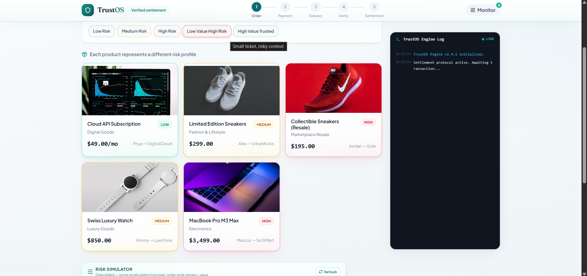

# TrustOS — Dynamic Transaction Control System

TrustOS is not a fraud-detection add-on — it's a **dynamic transaction control system** that decides how trust affects the movement of money, from payment authorization through delivery verification to final settlement.



## Core Idea

Every transaction is scored for risk using buyer trust, seller trust, and real-time transaction signals. That risk score determines — dynamically — how payment, delivery, and verification are handled. High-trust transactions move money instantly with zero friction. Low-trust transactions are held, verified, and only released once trust is proven.

> "When trust is high, TrustOS disappears. When trust is low, money doesn't move until it's proven safe."

## Risk Scoring

```
Risk = 100 - (0.4 × Buyer Trust) - (0.4 × Seller Trust) + Transaction Risk
```

| Risk Level | Score Range | Triggered By |
|---|---|---|
| 🟢 Low | 0–30 | High buyer/seller trust, low order value, known behavior |
| 🟡 Medium | 31–60 | Average trust, mid-value order, mild uncertainty |
| 🔴 High | 61+ | Low trust, high value, new/suspicious behavior |

**Note:** the scoring formula is currently static (fixed weights). Planned upgrade: replace with an ML model that dynamically learns weights from transaction outcomes instead of fixed coefficients.

## End-to-End Flow

**Payment**
| Risk | Behavior |
|---|---|
| Low | Immediate authorization + capture, normal settlement |
| Medium | Authorized only, funds blocked, capture delayed until confirmation |
| High | Funds routed to holding/wallet layer, seller doesn't receive money until verified |

**Delivery**
| Risk | Behavior |
|---|---|
| Low | Normal delivery, no proof required |
| Medium | Flexible delivery, manual confirmation later |
| High | Controlled delivery, OTP-based handoff, user presence required |

**Verification**
| Risk | Behavior |
|---|---|
| Low | Passive silent monitoring window |
| Medium | User-triggered confirmation, optional proof upload |
| High | Mandatory guided unboxing with continuous video, QR/seal validation |

**Settlement**
| Risk | Valid Transaction | Fraud/Dispute |
|---|---|---|
| Low | Already captured | — |
| Medium | Capture triggered | Capture canceled |
| High | Wallet releases funds | Funds refunded / not released |

## Proof System

- **Light Proof (Medium risk):** optional image/video upload, minimal friction, for lightweight dispute evidence
- **Full Proof (High risk):** mandatory continuous video of sealed package → QR/seal check → unboxing → final product. QR acts as a package identity + anti-tampering signal, checked for consistency against the video to prevent seller scams, false buyer claims, and package swapping

## API Routes

| Route | Purpose |
|---|---|
| `/trust/buyer` | Fetch buyer trust score |
| `/trust/seller` | Fetch seller trust score |
| `/decision/evaluate` | Computes risk score, risk level, recommended flow |
| `/payment/control` | Determines capture / hold / wallet routing |
| `/verification/start` | Triggers confirmation / video verification / QR validation |
| `/settlement/resolve` | Finalizes capture / cancel / release |

## Disputes

Disputes are handled differently per risk tier and feed back into trust scores:
- **Low:** logged during the silent monitoring window, adjusts future trust
- **Medium:** capture paused/canceled, proof reviewed, seller trust affected
- **High:** verification evidence analyzed, funds withheld pending refund/release decision

## What Was Actually Simulated vs. Real

Honest scope, stated upfront:
- Escrow/wallet holding logic, delayed capture, and settlement control are **simulated business logic**, not real banking/payment infrastructure integration
- API-level authentication (tokens/API keys) was implemented to protect routes; JWT/OAuth and role-based access are planned, not yet built
- This is a working prototype demonstrating risk-based orchestration logic — not a production payments system
- The AI risk engine (`/evaluate-product`) and the transaction flow engine (`create-order` → `pay` → `verify` → `settle`) were built as two separate systems for the hackathon demo. The flow engine currently uses a fixed amount-based threshold rather than calling the AI engine directly. Connecting them so the flow engine consumes the AI-generated risk score is the immediate next step.

## Tech Stack

**Backend:** FastAPI, Uvicorn, Pydantic. OpenAI API is used to generate natural-language explanations of why a transaction was scored low/medium/high risk.
**Frontend:** React + Vite, Tailwind CSS, Radix UI components, React Router
**Data:** In-memory storage (Python dicts for orders, payments, verifications) — no persistent database yet. This is a prototype-stage limitation, listed in Roadmap.

## Biggest Engineering Challenges

1. **Dynamic state orchestration** — keeping payment state, verification state, settlement state, and risk state consistent across every flow
2. **Explainable risk logic** — realistic, transparent scoring that stays demo-friendly without becoming an opaque black box
3. **UX vs. security tradeoff** — preventing fraud without adding friction to every transaction
4. **Simulating financial control safely** — mimicking escrow/delayed capture/wallet holds without real banking integration

## Roadmap

- [ ] Replace static risk formula with ML-based dynamic weighting
- [ ] Persistent database (currently in-memory only — data resets on restart)
- [ ] JWT/OAuth + role-based access control
- [ ] Service-to-service authentication
